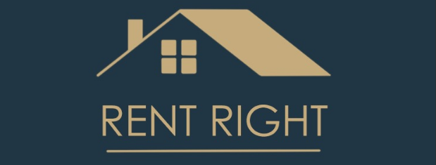

# Rent Right Mobile App

  

Rent Right is a powerful, open-source mobile app that utilizes artificial intelligence to predict rental prices for homes and apartments across the United States. Our goal is to provide valuable insights to both property owners and renters, helping them make informed decisions in the ever-changing real estate market.

## Table of Contents
- [About the Project](#about-the-project)
- [Features](#features)
- [Getting Started](#getting-started)
- [Contributing](#contributing)
- [License](#license)

## About the Project

Rent Right Mobile App is an open-source project that leverages this data to provide predictive rental price information for regions across the United States. Our mobile app aims to empower property owners, renters, and real estate professionals with accurate and up-to-date information to guide their rental decisions.

## Features

- **AI-Driven Predictions:** Our mobile app uses historical rental data to provide accurate price predictions.
- **User-Friendly:** The Rent Right mobile app is designed to be user-friendly, making it accessible to both property owners and renters.
- **Data Visualization:** Visualize rental price trends in different regions to make informed decisions.
- **Open Source:** Rent Right Mobile App is an open-source project, which means it's free to use, modify, and contribute to.

## Getting Started

Follow these steps to get started with Rent Right Mobile App:

1. Download the app from the App Store (iOS) or Google Play Store (Android).
2. Install the app on your mobile device.
3. Sign up or log in to access rental price predictions for properties in your area.

## Contributing

We welcome contributions from the community to improve Rent Right Mobile App. If you'd like to contribute, please follow our [Contribution Guidelines](CONTRIBUTING.md).

## License

This project is licensed under the MIT License - see the [LICENSE](LICENSE) file for details.

For any questions or inquiries, please contact [your_email@example.com](mailto:your_email@example.com).

Thank you for your interest in Rent Right Mobile App, a powerful, open-source tool for informed rental decisions on the go!
